# I. Mục lục

#### 1. Course Introduction

#### 2. Spring Boot Initialzr Demo

# II. Nội dung

## 1. Course Introduction

You will learn how to …

- Develop Spring Boot applications
- Leverage Hibernate/JPA for database access `(Tận dụng Hibernate/JPA để truy cập cơ sở dữ liệu)`
- Develop a REST API using Spring Boot
- Create a Spring MVC app with Spring Boot
- Connect Spring Boot apps to a Database for CRUD development
- Apply Spring Security to control application access
- Leverage all Java configuration (no xml) and Maven `(Tận dụng tất cả cấu hình Java (không có xml) và Maven)`

## 2. Java Development Environment

- We assume that you are already have experience with Java
  - OOP, classes, interfaces, inheritance, exception handling, collections
- You should have the following items already installed
  - Java Development Kit (JDK) - Spring Boot 3 requires JDK 17 or higher
  - Java IDE (we'll use IntelliJ in the videos, but any Java IDE will work)

## 3. Spring Boot Introduction

### 3-1. Spring in a Nutshell `(Tóm tắt Spring)`

- Very popular framework for building Java applications
- Provides a large number of helper classes and annotations

### 3-2. Spring Boot Solution

- Make it easier to get started with Spring development
- Minimize the amount of manual configuration `(Giảm thiểu số lượng cấu hình thủ công)`
  - Perform auto-configuration based on props files and JAR classpath
- Help to resolve dependency conflicts (Maven or Gradle)
- Provide an embedded HTTP server so you can get started quickly `(Cung cấp máy chủ HTTP nhúng để bạn có thể bắt đầu nhanh chóng)`
  - Tomcat, Jetty, Undertow, …

### 3-3. Spring Boot and Spring

- Spring Boot uses Spring behind the scenes
- Spring Boot simply makes it easier to use Spring

### 3-4. Spring Initializr

- Quickly create a starter Spring Boot project
- Select your dependencies
- Creates a Maven/Gradle project
- Import the project into your IDE
  - Eclipse, IntelliJ, NetBeans etc …

### 3-5. Spring Boot Embedded Server

- Provide an embedded HTTP server so you can get started quickly
  - Tomcat, Jetty, Undertow, …
- No need to install a server separately

### 3-6. Running Spring Boot Apps

- Spring Boot apps can be run standalone `(Độc lập)` (includes embedded server)
- Run the Spring Boot app from the IDE or command-line

### 3-7. Deploying Spring Boot Apps

- Spring Boot apps can also be deployed in the traditional way
- Deploy Web Application Archive (WAR) file to an external server:
  - Tomcat, JBoss, WebSphere etc …

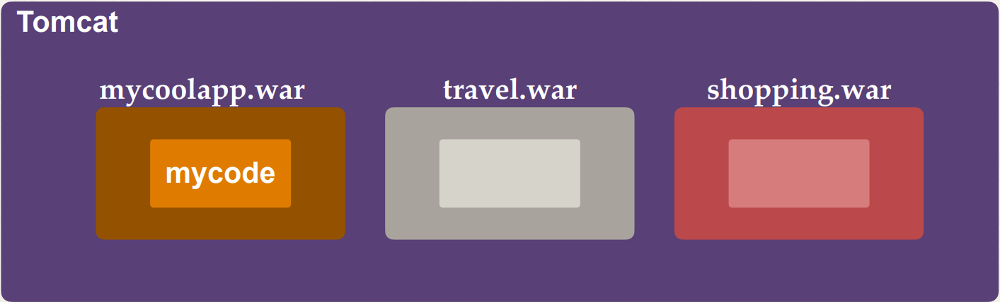

## 4. Maven

### 4-1. Quick Word on Maven

- When building your Java project, you may need additional JAR files
  - For example: Spring, Hibernate, Commons Logging, JSON etc…
- One approach is to download the JAR files from each project web site
- Manually add the JAR files to your build path / classpath

### 4-2. Maven Solution

- Tell Maven the projects you are working with (dependencies)
  - Spring, Hibernate etc ….
- Maven will go out and download the JAR files for those projects for you
- And Maven will make those JAR files available during compile/run
- Think of Maven as your friendly helper / personal shopper :-)

### 4-3. Development Process

1. Configure our project at Spring Initializr website: https://start.spring.io/
2. Download the zip file
3. Unzip the file
4. Import the project into our IDE

### 4-4. Maven How it work

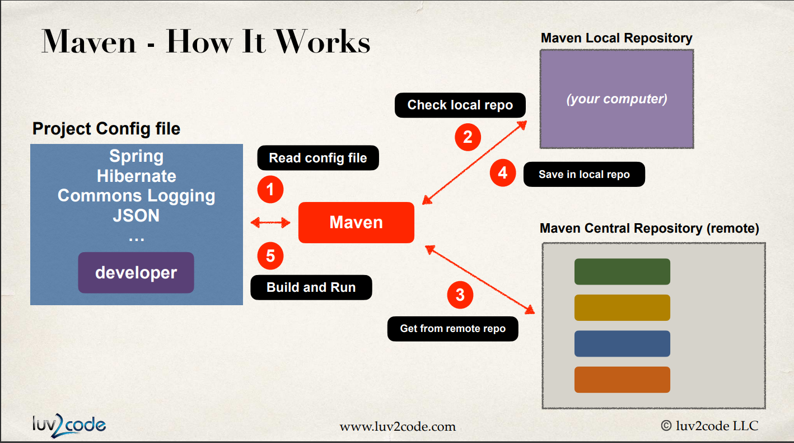

### 4-5. Handling JAR Dependencies

- When Maven retrieves a project dependency
  - It will also download supporting dependencies
  - For example: Spring depends on commons-logging …
- Maven will handle this for us automagically

### 4-6. Building and Running

- When you build and run your app …
- Maven will handle class / build path for you
- Based on config file, Maven will add JAR files accordingly

## 5. Maven Key Concepts

### 5-1. POM File - pom.xml

- Project Object Model file: POM file
- Configuration file for your project
  - Basically your “shopping list” for Maven :-)
- Located in the root of your Maven project

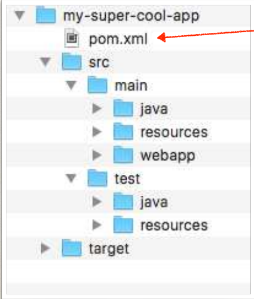

### 5-2. POM File Structure

- Project name, version etc, Output file type: JAR, WAR, …
- List of projects we depend on Spring, Hibernate, etc…
- Additional custom tasks to run: generate JUnit test reports etc…

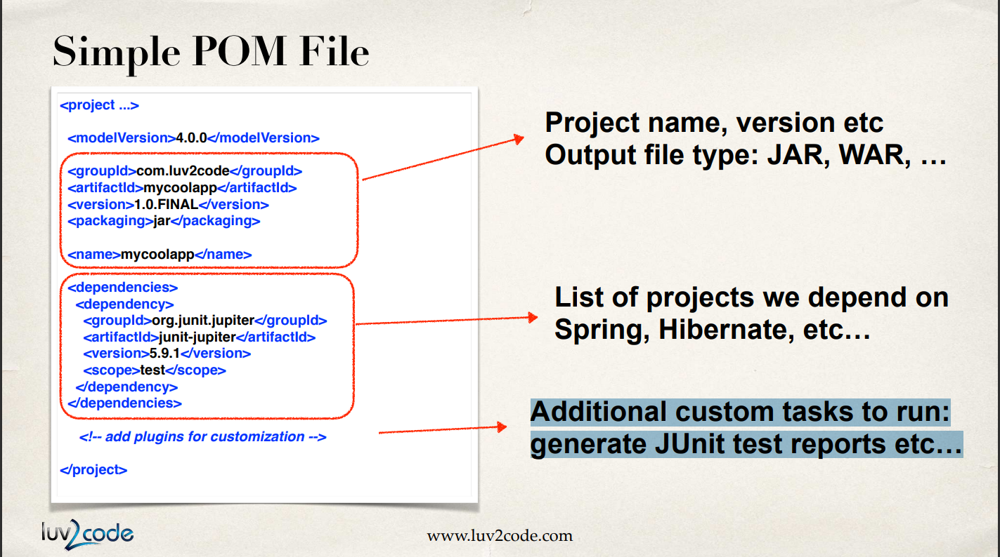

### 5-3. Project Coordinates

Project Coordinates uniquely identify a project `(Tọa độ dự án xác định duy nhất một dự án)`

- Similar to GPS coordinates for your house: latitude / longitude `(Tương tự tọa độ GPS cho ngôi nhà của bạn: vĩ độ/kinh độ)`
- Precise information for finding your house (city, street, house #) `(Thông tin chính xác để tìm nhà của bạn (thành phố, đường phố, số nhà))`

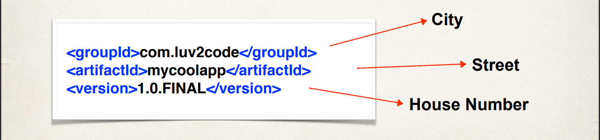

### 5-4. Project Coordinates - Elements

| Name        | Description                                                                                                    |
| ----------- | -------------------------------------------------------------------------------------------------------------- |
| Group ID    | Name of company, group, or organization.  Convention is to use reverse domain name: com.luv2code            |
| Artifact ID | Name for this project: mycoolapp                                                                               |
| Version     | A specific release version like: 1.0, 1.6, 2.0 …  If project is under active development then: 1.0-SNAPSHOT |

### 5.5. Dependency Coordinates

- To add given dependency project, we need
  - Group ID, Artifact ID
  - Version is optional …
    - Best practice is to include the version (repeatable builds)
- May see this referred to as: GAV
  - Group ID, Artifact ID and Version

## 6. Spring Boot Dev Tools

### 6-1. The Problem

- When running Spring Boot applications
- If you make changes to your source code
- Then you have to manually restart your application :-(

### 6-2. Solution: Spring Boot Dev Tools

- spring-boot-devtools to the rescue!
- Automatically restarts your application when code is updated
- Simply add the dependency to your POM file
- No need to write additional code :-)
- For IntelliJ, need to set additional configurations ... will discuss shortly

## 7. Spring Boot Actuator

### 7-1. Problem

- How can I monitor and manage my application?
- How can I check the application health?
- How can I access application metrics?

### 7-2. Solution: Spring Boot Actuator

- Exposes endpoints to monitor and manage your application
- You easily get DevOps functionality out-of-the-box
- Simply add the dependency to your POM file
- REST endpoints are automatically added to your application

### 7-3. Spring Boot Actuator

- Adding the dependency to your POM file

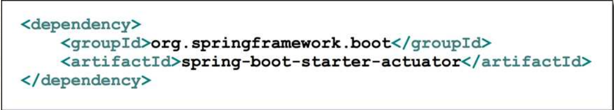

- Automatically exposes endpoints for metrics out-of-the-box `(Tự động hiển thị các điểm cuối cho các số liệu có thể dùng ngay)`
- Endpoints are prefixed with: /actuator `(Điểm cuối có tiền tố là: /actuator)`

| Name    | Description                               |
| ------- | ----------------------------------------- |
| /health | Health information about your application |

### 7-4. Health Endpoint

- /health checks the status of your application
- Normally used by monitoring apps to see if your app is up or down

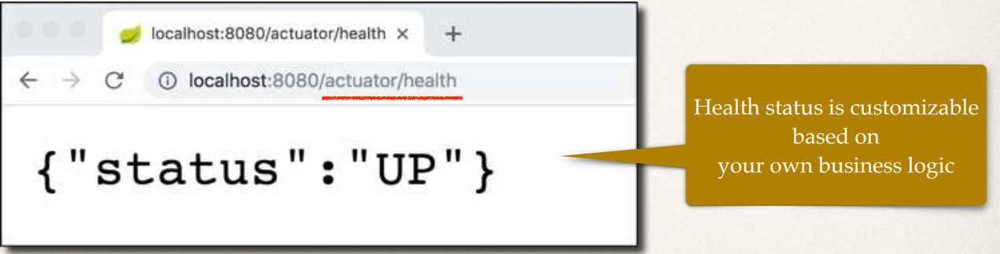

### 7-5. Exposing Endpoints

- By default, only /health is exposed `(Mặc định, chỉ có /health được hiển thị)`
- The /info endpoint can provide information about your application `(Điểm cuối /info có thể cung cấp thông tin về ứng dụng của bạ)`
- To expose /info `(Cho hiển thị điểm cuối)`

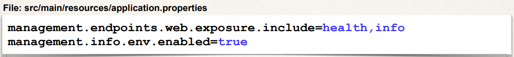

## 8. Spring Boot Starter Parent

### 8-1. Spring Boot Starter Parent

- Spring Boot provides a "Starter Parent"
- This is a special starter that provides Maven defaults
- Maven defaults defined in the Starter Parent
  - Default compiler level
  - UTF-8 source encoding
  - Others …

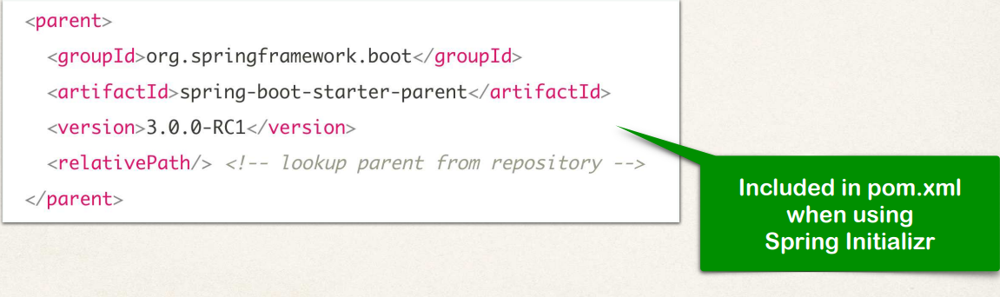

- To override a default, set as a property

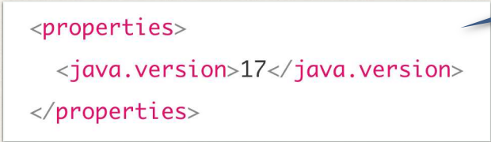

- For the spring-boot-starter-\* dependencies, no need to list version

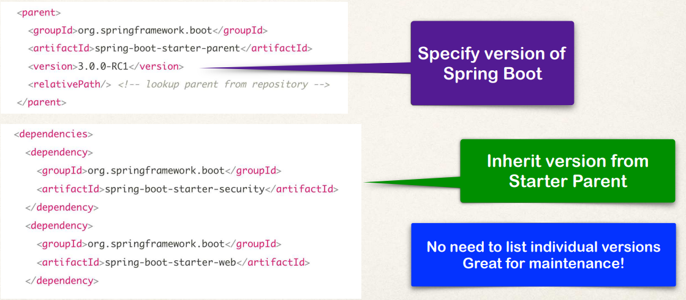

- Default configuration of Spring Boot plugin

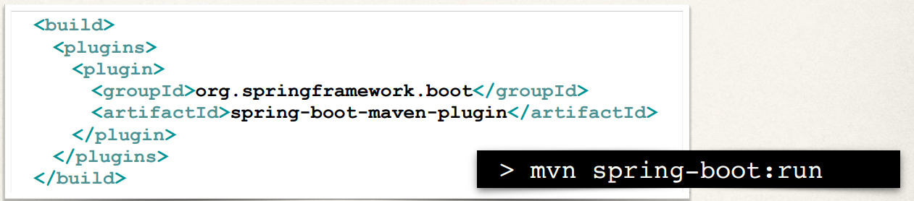

### 8-2. Benefits of the Spring Boot Starter Parent

- Default Maven configuration: Java version, UTF-encoding etc
- Dependency management
  - Use version on parent only
  - spring-boot-starter-\* dependencies inherit version from parent
- Default configuration of Spring Boot plugin
